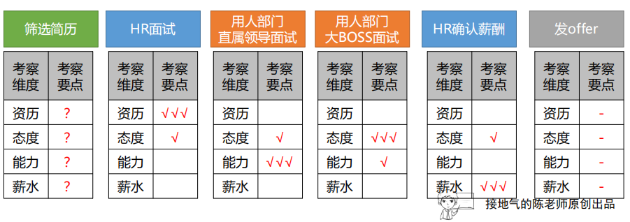

# 第2章 由浅入深构建分析思路

## 1 基础思路之“是多少”，描述问题

### 1.1 解决“是多少”的基本思路

- 问题本质：指标体系（销售、商品、客户）+常规走势（季节性趋势、生命周期趋势、主动行为）
- 举例：销售情况怎样？
    1. 总体情况
    2. 总体情况-看趋势
    3. 分类情况-商品-总体
    4. 分类情况-商品-趋势
    5. 分类情况-渠道-总体
    6. 分类情况-渠道-趋势

- 常见业务问题分析思路：
    - 渠道分析：漏斗分析，矩阵分析，结构分析
    - 商品分析：ABC分类，动销率/周转率，LTV
    - 产品分析：漏斗分析，UJM
    - 用户分析：价值分层，RFM

### 1.2 特殊的“是多少”问题

- 叠加效应：需要考虑参照组、参照时间、参照物
- 专有名称：高价值用户、潜力用户、流失用户、引流产品等专有名称，确认口径
- 注意事项：
    - 培养好的习惯：先问是多少，再问为什么
    - 找原因的前提，是有清晰的过程和结果判断

## 2 基础思路之：是什么，寻找标准

### 2.1 常用的标准参照物

- 常用标准参照物
    - KPI考核法：本月目标是xxx，推翻难度高
    - 老板期望值法：老板觉得它应该是xxxx，推翻难度高
    - 整体目标分解法：为了整体销售达标，A必须做到xxxx，推翻难度高
    - 环比趋势法：过去每个月都有xxxx，推翻难度低
    - 走势分析法：过去三个月有xxx，推翻难度低
    - 同比趋势法：去年这个月有xxx，推翻难度低
    - 同类相比法：和A类似的城市B是xxxxx，推翻难度低
    - 投入反推法：B市做了xxxx（不能比其他做得差），推翻难度中
    - 投入产出比法：A投入产出比只有xxxx，平均xxxx，推翻难度中

- 注意事项：
    - 标准不清晰、不统一，随便变化，是导致分析出问题的头号原因

### 2.2 自带标准的分析方法

- 周期分析法：周平均水平
- 趋势分析法：趋势的情况
- 矩阵分析法：矩阵维度，正常情况下，所有的点应该在一条直线上
- 分层分析法：二八分层原则、头部与尾部
- 线性规划法：约束条件

## 3 基础思路之：为什么，寻找原因

- 找原因的前提，是有清晰的过程和结果判断

### 3.1 简单原因分析

- 简单原因分析三种方法：
    - 结构分析法：列出整体的内部结构，优先关注变化幅度大
    - 指标拆解法：列出指标拆解公式，优先关注变化幅度大
    - 漏斗分析法：哪里差，补哪里，结合每个步骤的业务含义，提出优化意见

- 三种方法的不足：
    - 无法直接解答业务问题
    - 维度太多，找不出重点
    - 很难发现深层原因

### 3.2 归纳法（总结经验） VS 演绎法（测试理论）

- 归纳法：
    - 作用：通过交叉对比，为了提炼规律
    - 适用场景：发现深层关联
- 归纳法一般思路：
    - 正向例子：只要有A出现的，都会出问题
    - 反向例子：只要没有A出现的，都不会出问题
    - 结论：A是导致问题的主要原因
- 演绎法：
    - 作用：测试&假设检验，为了验证演绎结论
    - 适用场景：直接验证业务假设，用来证伪
    - 好处：快速得出结论，直接指向业务动作
- 演绎法一般思路：
    - 假设：出现A就会出问题
    - 测试1：出现A的时候，确实出现问题
    - 测试2：没有出现A的时候，确实没问题

- 缺陷：
    - 归纳：幸存者偏差，可能成功的只是特定类型
    - 演绎：幸运者偏差，测试数量太少，环境单一

### 3.3 复杂的多层级、多指标分析

- 使用方法：MECE法，多次二分类拆分
- 拆分角度：
    1. 以管理上可落地的维度进行拆分，用于业务行为
    2. 从数据上差异最大的开始，用于取数据
- 基于假设的多轮验证，也可以得到结论：每一轮测试，尝试抽取一些关键维度做分组对比，淘汰差异不大，不稳定的

## 4 基础思路之：会怎样，预测未来

- 预测的基本逻辑：假设未来和过去一样
    - 过去的走势，未来会出现（时间序列法、滚动预测法）
    - 过去的影响因素，未来会同样影响（因果关系法，业务假设法）
- 预测的关键：业务要不要参与，
    - 无业务参与：无解释
    - 有业务参与：向业务索取假设，基于业务参数预测

### 4.1 业务可以参与的预测

- 滚动预测法：
    - 思路：假设过去某个参数固定，滚动到下期
    - 适用场景：有稳定的转化率/留存率的场景
- 业务假设法：
    - 思路：把影响结果的公式列出来，让业务自己填假设，汇总结果
    - 适用场景：制定计划，给定业务定目标的场景

### 4.2 业务没法参与的预测

- 时间序列法：
    - 本质：假设过去的走势会维持
    - 操作方法：使用Excel，选择合适的曲线形态，计算MSE值
- 指数平滑法：使用Excel函数中的指数平滑，设定不同的阻尼值
- 因果关系法：找影响业绩的关键因素

## 5 基础思路之：又如何，综合判断

### 5.1 简单的综合评估问题

- 问题判断：凡是单一指标不能描述好坏的，都是综合判断问题
- 关键：判断维度+权重
    - 维度是连续型变量，就容易处理，避免分类变量和含叠加因素的变量
    - 权重：一票否决制、优先级制、加权评分制

- 综合判断问题难度等级：
    - 最简单（两个维度）：矩阵分析
    - 复杂+1（多个维度，连续型指标）：权重，分级、打分，加总
    - 复杂+2（多个维度，混合分类变量）：做纯指标，神经网络

### 5.2 复杂的综合评估问题

举例：APP上线情况
- 0级难度：
    - 需求：获取新功能上线5天内每天使用人次，不去重
    - 方法：直接取数问题
- 1级难度：
    - 需求：取一下新功能上线5天内，有多少人用
    - 方法：
        1. 有方向，无具体指标，需要多个指标说明问题
        2. 直接取数问题
- 2级难度：
    - 需求：用A功能的人，付费是否更好
    - 方法：
        1. 问题涉及多个对象的对比，统一口径指标，多角度反映问题
        2. 拆分多个指标（1级深度）
        3. 直接取数问题（0级深度）
- 3级难度：
    - 需求：为什么A付费更好
    - 方法：
        1. 基于事实的推论、假设验证
        2. 多角度反映问题（2级深度）
        3. 拆分多个指标（1级深度）
        4. 直接取数问题（0级深度）
- 4级难度：
    - 需求：新上一个A功能有啥影响
    - 方法：
        1. 基于业务场景拆解
        2. 基于事实的推论、假设验证（3级深度）
        3. 多角度反映问题（2级深度）
        4. 拆分多个指标（1级深度）
        5. 直接取数问题（0级深度）
- 数据分析的基本定律：字数越少，麻烦越多       
- 处理问题的方法：
    - 前期尽量清晰需求
    - 对方不清楚情况，先给基础数据
    - 引导思考，逐步缩小范围

## 6 深入分析，是基础思路的组合

**案例：** 为什么AI人才那么难招？

1. 清晰问题发起人（主语）：关心啥，有啥能力解决问题
2. 清晰分析业务对象（主语）：什么是AI人才？确定AI人才的指标
3. 清晰分析业务对象（谓语）：招聘流程（动词一般意味着业务流程）
4. 清晰标准：什么是难？从什么时候开始难？一直很难还是最近很难？（形容词意味着判断标准）
5. 【后续】基于数据，总结假设
6. 已知业务逻辑的情况，可以直接做演绎推导：
    - 人已经满意了，但是人家不满意我们提供的薪酬
    - 为什么能通过甄别，但用人部门不认可能力？
7. 未知逻辑的情况下进行归纳：
    - 收集数+甄别通过率：使用矩阵分析

