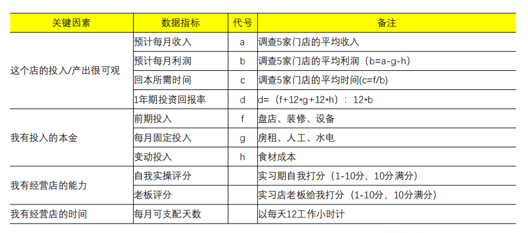
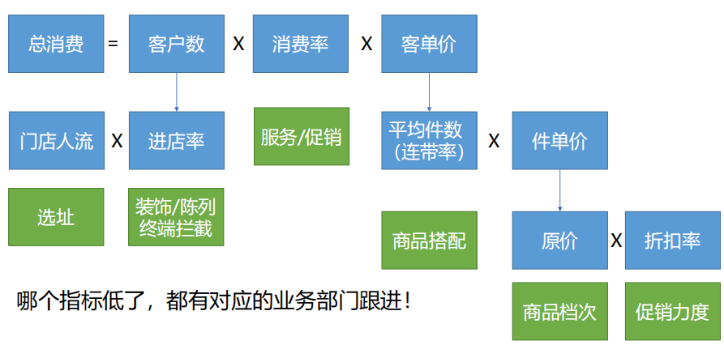

# 第2章 从0开始，梳理数据指标体系

## 1 并列式指标梳理

- 目的：综合性的评估
- 关键：评估关键影响因素（相互独立、决定影响）
- 步骤：
    1. 找到关键影响因素
    2. 尝试用数据量化

    

- 让指标体系好使，得配合标签/分类维度
- 指标+标准才能进行判断

## 2 包含式指标梳理

- 目的：用于反映内部结构
- 包含关系的分类方法不止一种
- 包含式的指标体系，自身带有分析能力，沿着指标体系，一路往下寻找问题的起点

## 3 流程式指标梳理

- 目的：般用于描述转化过程
- 注意事项
    - 关键梳理清楚流程的步骤，确定每个环节的人数和上下环节转化率
    - 把整个过程表示为数据，每个环节的人数减少，并包括上下环节转化率
    - 影响漏斗转化的两类因素：局部变量和全局变量
- 漏斗分析：
    - 分析方法：
        1. 哪里差，补哪里
        2. 挑选更好的产品
        3. 观察改善效果：给每个转化流程圈定能力上下限，判断是否稳定
        4. 挑选更优质的渠道
    - 注意：
        - 如果执行了流程，但中间有跳出，仍完了全流程，纳入漏斗统计
        - 实际情况可能比预想的丰富，需关注不同流程人数变化

# 4 现实中梳理指标体系的难点

- 难点：
    1. 对业务不熟悉：实际业务流程千奇百怪，业务做的事情也五花八门
    2. 没有数据采集：有数据，很简单；没数据，啥都难
    3. 没有业务目标：有目标，就很容易做；没目标，就混乱

- 总结：
    - 交易型的指标体系容易梳理：场景容易理解（进货、库存、销售）、目标清晰（提高成交率、提高交易额）、数据相对清晰（线上埋点、线下成交订单）
    - 非交易型的指标体系相对难    