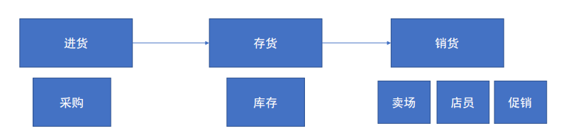
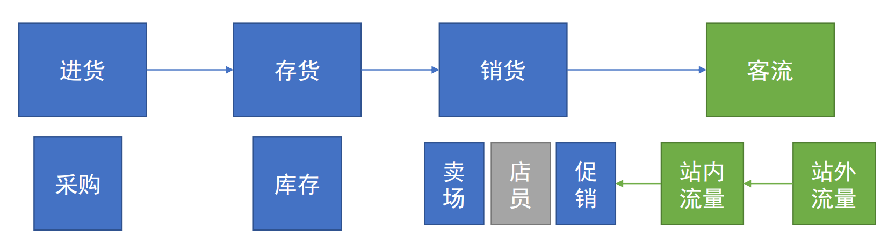
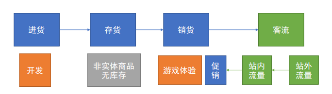
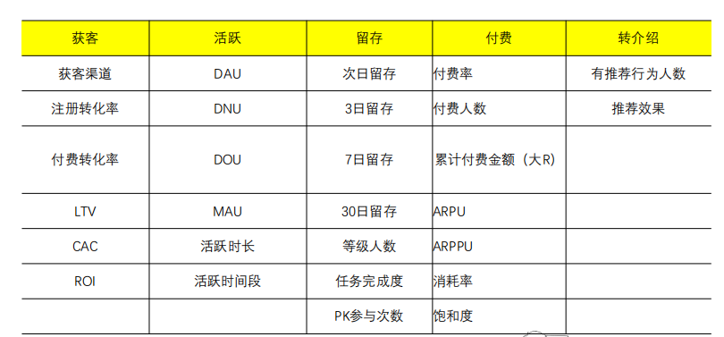
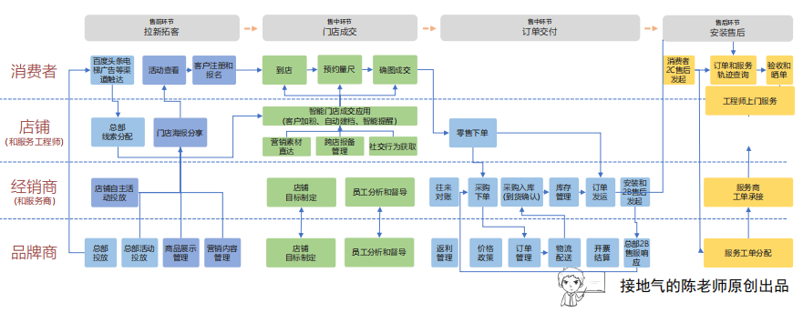

c# 第3章 交易型的数据指标体系

## 1 零售类指标

- 零售模式：进货->库存->销售
- 数据简单：商品编号、商品价格、进货时间、销售时间、销售金额
- 零售三要素：三个要素并列关系
    - 人：店员
    - 货（关键）：商品
    - 场：门店
- 货的业务流程：进货->存货->销货，分为良性循环和恶行循环

- 基础指标：
    - 选的什么款：品类、SKU
    - 卖得好不好：日销售数量、销售价格、折扣率
    - 库存有多少：库存数量、库存可用时间
    - 进货难不难：进货成本、进货满足率
    - 表现怎么样：毛利、毛利率
- 扩展指标：
    - 选的什么款（产品标签）：流量款、爆款、利润款、搭配款、防御款
    - 卖得好不好：销售排行、动销率、售罄率、购买率、连带率
    - 库存有多少：库龄、库存周转率（财务）、库存损失、叠加损失
    - 进货难不难：到货天数、在途损失、发货及时率

## 2 电商类指标

- 电商能记录页面流量、用户ID
- 电商场景公式：$\text{GMV}=\text{UV} \times \text{转化率} \times \text{客单价}/ \text{销量} = \text{用户数} \times \text{付费率} \times \text{客单价}$

- 业务流程：进货->存货->销货->客流

- 与零售指标不同，新增：流量指标、用户指标
- 流量购买：
    - cpm（cost per mile）：每千次曝光收费（钻展）
    - cpc （cost per click）：每点击收费（直通车）
    - cpa （cost per action）：下载等行为收费
    - cps （cost per sale）：付费次数收费（淘宝客）
- 成交漏斗
- 客户RFM：以用户ID统计
    - R：用户最后一次消费距今时间
    - F：在一定时间内购买频次
    - M：在一定时间内累计购买量

## 3 游戏类指标

- 本质：卖虚拟商品
- 不付费玩家也是付费玩家的体验之一
- 业务流程：进货->存货->销货->客流

- AARRR不是五个指标，是观察的五个方面：A（Acquistion，获客）、A（Activation，活跃）、R（Retention，留存）、R（Revenue，付费）、R（Refer，转介绍）

## 4 toB类指标

- toB类业务下游：大客户、经销商等
- toB各阶段收集的信息（标签/指标）
    - 客户线索：企业名称、行业归属、联系人、联系人职位
    - 初次沟通：需求数量、交付时间
    - 深入沟通：关键决策人、功能要求、交付要求
    - 产品体验：功能评价
    - 投标议价：价格评价、竞标对手
    - 中标结果：中标结果
- 额外收集的指标
    - 大客户：客户的行业情况、企业情况、竞争对手
    - 经销商：经销商实力、订货数据、出货数据
- 最少需要的指标：
    - 线索数：所有销售起点、直接反应营销推广质量
    - 成单率：签约/线索，直接反应销售质量
    - 成单时间：从线索入库到签约时间
    - 报价：价格是同行高/中/低档位
    - 成单数：业绩
- 最少需要的维度：
    - 客户行业：是否我司优势行业
    - 客户地区：是否客户集中区域
    - 客户企业名：是否行业龙头

## 5 交易型指标小结

- 交易型业务共同点：
    1. 目标清晰：成交
    2. 流程清晰：进货->库存->销售
    3. 核心指标清晰：成交金额、成交订单数、商品销售数量
    4. 核心流程清晰：有过程数据，使用漏斗分析；没有过程，使用指标拆解

- 关键因素
    1. 实体商品（物流、库存、采购、成本）和虚拟商品（研发、资金、广告）
    2. 线下渠道（人、货、场）和线上渠道（漏斗模型）
    3. toC（RFM、AARRR）和toB（售前的客户信息、交易流程、客户评价）
    4. 高频和低频

