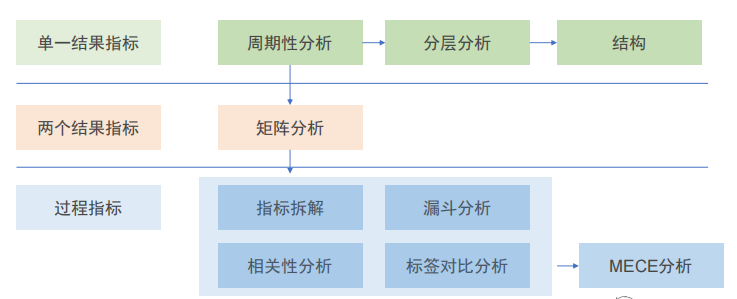
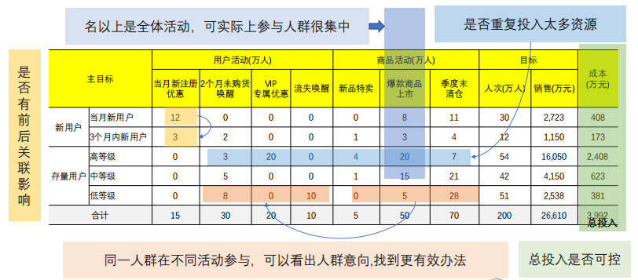
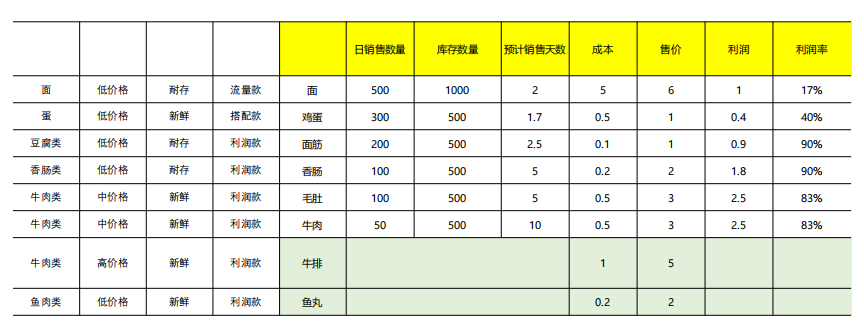
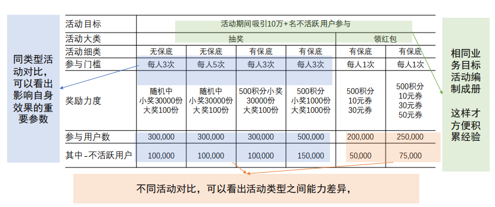
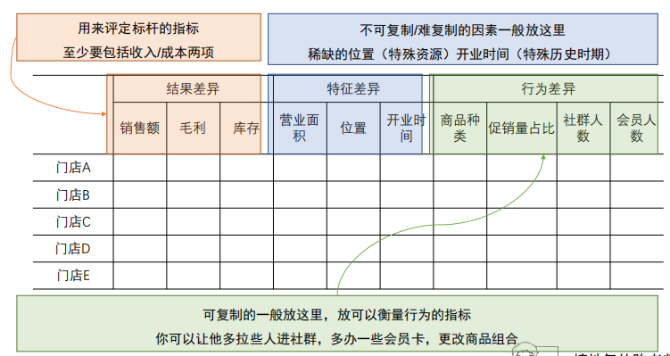

# 第1章 数据报表的作用与意义

## 1 各种类型的数据报表

- 明细表：供业务查询使用
- 统计表：
    - 临时表：计算表（业务会二次加工计算）、取数表（业务直接拿来用）
    - 固定表：短期表（活动、推广等）、长期表（日报、周报、月报、季度报等）

## 2 报表在数据体系中的作用

- 反直觉事实：数据分析领域，是越高深的知识，越没地方用，用起来纯添乱
    - 统计学：除了基础概念部分，统计学更多是为解决抽样实验的问题
    - 运筹学：分析思维在任务分配问题上具体落地
    - 算法：机器学习处理不了复杂的业务问题
- 所有专业方法，都可以用报表替代
    - 预测问题，不用模型，直接使用同比、环比
    - 测试问题，不用统计学，直接赛马即可
    - 分配问题，不用运筹学，直接标准打分
- 报表核心地位：
    - 所有人都看得懂
    - 大部分问题必须看它
    - 复杂的问题它也能凑合

## 3 报表难题的根源

- 根源分析：
    - 从表面看，问题来自于，搞不懂业务想干啥
    - 深一层看，问题来自于，内行服务外行
    - 再深一层看，到底谁是内行，谁是外行：在具体业务问题上，数据分析师反而是外行
- 破局思路：
    - 方法通俗化：拒绝神秘主义，讲清楚每种数据分析方法的作用与使用范围（降低业务期望）
    - 思路标准化：针对业务流程建指标体系，按标准流程进行分析，不需要胡思乱想
    - 服务差异化：需要专业方法（统计学/运筹学/机器学习）或探索性问题（连指标都不确定）单独服务
    - 输出产品化：有了标准化指标+思路后，固定成BI看板，减少SQL数量，释放数据劳动力

### 3.1 方法通俗化    

- 定义：越复杂，越看似专业的方法，应用范围越窄，越针对具体问题，不在适用范围，不要乱用
    - 统计学：抽样测试的时候才用（用户调查、商品质检、页面测试）
    - 运筹学：已知投入产出能力，且假设投入产出关系稳定时，优化分配方案才用（AB生产线各产多少）
    - 机器学习：已有数据积累，做预测/推荐时才用（已知过去业绩，预测未来业绩）
    - 不管是统计学或机器学习模型，都不具备业务可解释性，且不具备预测黑天鹅事件能力
    - 所有的方法，无法预测业务的主观能动性

### 3.2 思路标准化（详见九大分析方法）

### 3.3 服务差异化

主要解决疑难杂症：
- 测试问题：抽样多少，测什么指标，控什么影响因素（用统计学）
- 预测问题：业绩预测、用户响应预测、商品库存预测（用算法）
- 定义问题：高价值（指标）
- 叠加问题：转化率提不上去，到底是商品、文案、价格不行（三个因素相互叠加）
- 利益问题：牵扯利益纠纷

### 3.4 输出产品化

- 业务问题（预测/推荐/测试/优化问题）：机器学习/统计学/运筹学方法
- 大部分常规问题：标准数据指标体系（标准分析方法），使用自动化报表/BI
- 少数复杂问题：深度专项分析，方法论积累

## 4 突围起点：一张简单的需求登记表

### 4.1 需求登记表

- 需求人、需求部门、需求发出时间、预计拿到时间
- 数据使用目的：是否与现有报表相关、与哪个业务活动有关
- 需求描述：
    1. 数据指标
    2. 分类维度
    3. 统计时间
    4. 统计范围
    5. 出数表格式
- 是否涉及敏感数据：由数据部门需求评审填写
- 是否复杂需求：由数据部门需求评审填写
- 数据审批权限：建议选项（经理、总监VP）

### 4.2 需求登记表的作用

1. 统计工作量
2. 减少争吵，转移矛盾
3. 了解业务的需求
4. 夺取主动权，引导需求
5. 发现扩展项目的机会
6. 从临时取数到固定产品
7. 跟上业务思路

## 5 梳理有价值的取数需求

- 在企业工作中应用：
    - 能做固定报表的，做固定报表
    - 能上数据看板的，上数据看板
    - 能上AB平台的，上AB平台
    - 能上模型的，上模型

- 基本原则：
    1. KPI类监控报表，直接做成看板
    2. 在经营分析中，监控业务，发现问题部分直接做看板
    3. 一线可以直接做看板或者数据产品
    4. 业务部门的分析任务里，监控、复盘部分可以直接做看板或者自动报表
    5. 诊断型分析是最复杂的，直接上专题分析
    6. 预测、测试问题用专业数据产品/模型支持

- 总结思路：
    1. 目标监控体系，先做出来，而且很适合用BI
    2. 高层的经营分析，把发现问题与诊断问题分开，诊断的问题单独做，发现问题用BI
    3. 基层的数据看板，不要牵扯复杂的分析逻辑，直接简单，看数做事
    4. 中层是最复杂的，区分六大类需求（策划、预测、监控、诊断、测试、复盘）
        - 监控、复盘是相对简单的，可以直接用BI
        - 策划很麻烦，业务思路会很发散，消耗人力，但可以做模板
        - 诊断和业务有没有假设有直接关系，虽然麻烦但可以部分做模板
        - 预测是老大难问题，可以直接引入产品
        - 测试要上AB平台，可以直接引入产品

## 6 高价值取数报表

- 高价值：经营分析（最常考）、热点（用户、活动、商品、渠道）

## 6.1 用户报表梳理重点

- 存在的问题：
    - 只有收入端或只有成本端
    - 只有宏观层面（拉新、活跃、留存）或微观层面，只有消费行为（缺乏点击、转化）
- 能接触到用户数据，就可以自己取数
    - 有消费数据+用户ID -> 用户价值分层 -> RFM -> 用户活跃/流失（消费口径）
    - 内容、工具类产品，可以用停留时长，点击次数替代消费金额做RFM

### 6.2 商品报表梳理重点

- 难点：
    - 常规报表：商品有多少在库，每个门店卖了多少
    - 零散取数：这个A商品上周卖了多少
- 能接触到商品销售、商品库存数据，就能自己包装成项目
    - 商品分类、商品生命周期，完全可以自己算
    - 商品太多的情况下，不指望全部搞懂，搞懂几个典型品类就行

 

### 6.3 活动报表梳理重点

- 难点：只看一个活动，很难看出结果来
- 按活动**目的归类**，做横向对比
    - 促活类活动形式有5种，大转盘、抽奖、福袋、游戏、签到
    - 促首单的活动，有4种，单品爆款，1毛抢购，限时特惠，大额优惠券

### 6.4 渠道报表梳理重点

- 难点：
    - 线下的，看到门店收入、毛利，但是不知道如何解读
    - 线上的，看到渠道转化率，但是不知道如何解读
- 找样板，打标签
    - 线下的：门店位置、店长水平、经营手段
    - 线上的：投放形式、投放素材、投放渠道

## 7 需求梳理案例

**案例：** 某耐用品公司客服，客服接听客户来电，主动联系新购买设备客户进行安装、设备维护，接受客户售后需求，保修期内免费上门，超过保修期，也可以提供收费的保修服务。

**第1步：业务梳理**

1. 客户咨询（人工成本）
2. 主动作业：安装（人工/材料）、主动保养（人工/材料）
3. 被动任务：保修（人工/配件）、维修（产生收入、人工/配件）
4. 二次销售（产生收入、新/配套设备）

**第2步：确认业务结果**

&emsp;&emsp;一个流程有多个指标，确认结果指标，需要先看流程的最后一步，一般最后一步是衡量流程数量的流程转化率，统计流程结尾/流程起点，完成时间也是从起点到结尾，服务类业务还可以加上满意度。

**第3步：梳理过程指标**

&emsp;&emsp;在一个流程中，前后关系可能是人数流失，也可能是时间/成本增加。在梳理指标体系时，要理清前后流程的关系，清晰展示整个过程。

**第4步：优化指标/维度**

- 咨询模块：产品类型（新上市、升级、老产品）、咨询内容（价格、功能、使用、保修政策、产品问题）、咨询数量
- 维修模块：地区、旧品年限、旧品保有量、保修工单数、维修工单数

**第5步：打造一个好听的故事**

1. 先树靶子（降低期望）：凡是收入-成本-利润容易梳理，客服不好梳理
2. 导致恶果：数据价值得不到利用，客服工作效率低
3. 介绍思路：
    - 清晰业务定位
    - 梳理结果指标，梳理投入产出
    - 梳理过程指标
    - 根据每个场景需要构造关键维度
