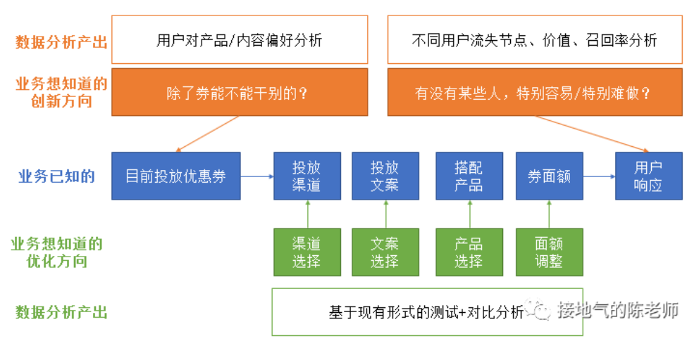
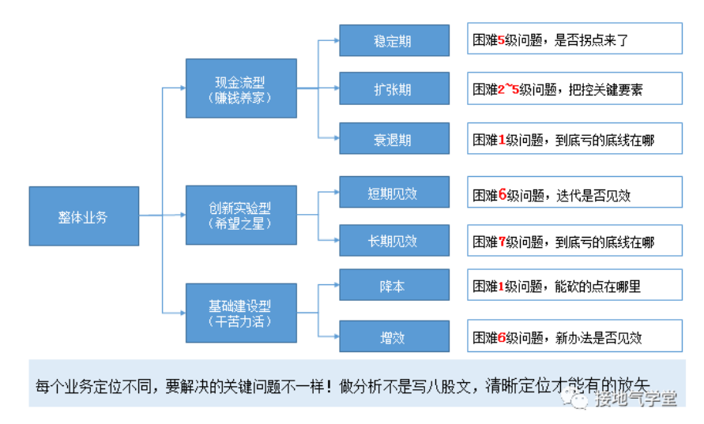
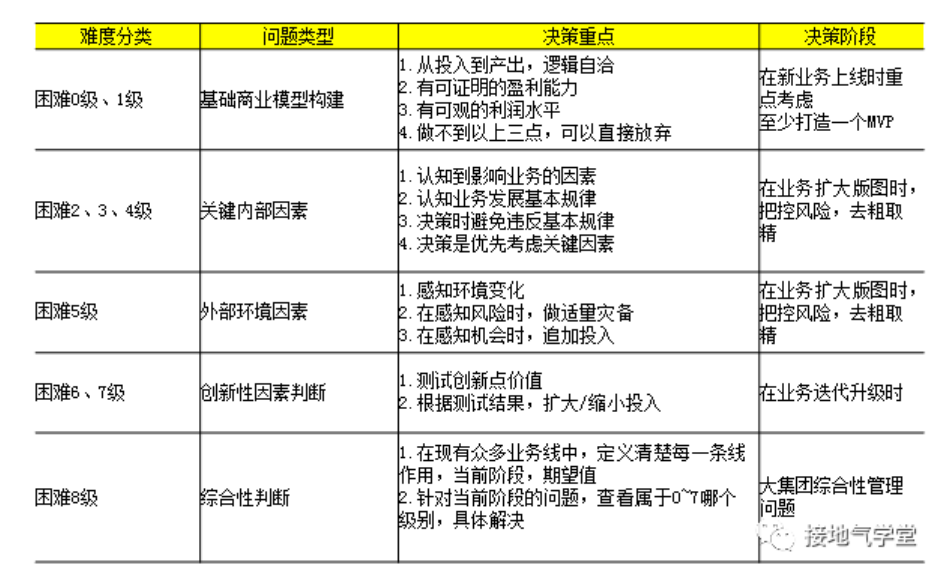
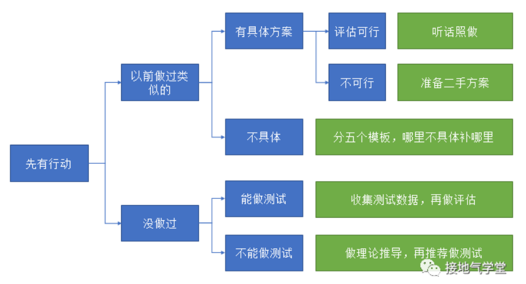
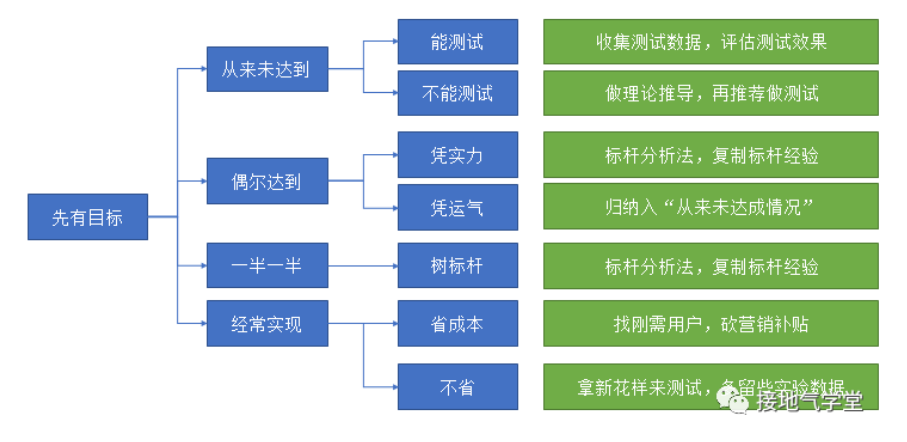

# 第1章 数据赋能

## 1.1 数据的作用

### 1.1.1 数据分析的价值是什么？

- 提升数据分析的价值感：到底我们的业务需要什么
- 拆解业务问题：不能直接结合业务场景拆解需求
- 寻找业务盲点：
    1. 业务不知道什么
    2. 业务不确定什么
    3. 业务想测试什么

- 经验积累：可以主动收集各部门活动，以用户为单位，展示各类活动影响用户全景

&emsp;&emsp;综上可见，数据分析要基于业务，为业务服务，并不是一句空话，而是结合具体的业务场景与业务需求，具体讨论业务可行范围，拆解业务问题，逐一解答才能实现。

### 1.1.2 十张图，数据分析如何赋能销售

- 销售部门：深入理解销售部门的流程，认真观察他们的实际困难，销售流程：拨号、接通、开场、介绍、答疑、促单、成交
- 数据对基层有用：认真拆解操作流程，看看到底哪些环节能帮上忙
    1. 拨号、接通：标杆销售行为分析、用户接听率预测、用户接听行为分析、用户二次接听分析
    2. 开场、介绍：标杆销售行为分析、成交订单分析、失败订单分析、话术ABTest
    3. 答疑：资料库使用率分析、高频搜索词分析
    4. 促单：成交订单分析、用户需求分析
    5. 成交：销售行为分析
- 数据对中层有用：
    1. 计划：每日提醒、每周任务分配、情况分析
    2. 组织：晨会、周会、月会
    3. 控制：每日进度提醒、每周表彰问题提醒、正式奖励/处罚、结果复盘
    4. 领导：每日简单激励、每周辅导、月度激励、培训辅导
- 数据对高层有用：专题分析的逻辑可以围绕如何区分销售/其他部门协同问题角度入手，拆出多个专题来深入解读

## 1.2 数据驱动决策

### 1.2.1 数据分析如何支持管理层决策

- 决策的四大要素：决策目标、决策层级、评价因素、效果
- 决策的四大原则：
    1. 清晰决策目标
    2. 决策层级围绕决策目标构建
    3. 每一级决策受到上一级制约
    4. 每一级决策有自己的评价因素
- 数据的作用：澄清现状、梳理逻辑、计算过程
- 单产品线/业务线的典型策略：数据分析的重点，在于判断被动因素的真伪，给出足够多的理由支持/否定被动因素
    1. 增长：大幅度提升
    2. 平稳：维持现状，略有增长
    3. 收缩：允许小幅下跌
        - 主动选择：腾出资源为新业务让路
        - 被动（内部）：业务已到生命周期末尾
        - 被动（外部）：市场空间已饱和
- 多产品线的典型策略：
    1. 重点发力：主要依靠爆款带动增长
    2. 新品带动：主要依靠新品增长
    3. 多元化：增强非主力的份额
- 支持决策：投入产出分析、内部发展历程分析、增长性评估
- 数据支持决策的难点：
    1. 不懂业务，部门、层级、分工、目标完全弄不清
    2. 没有分清决策层级，不是做得太浅，就是一下扎得太细
    3. 没有罗列每一级的评估因素，评估不够充分，不能说服人

### 1.2.2 从0到1，搭建决策分析模型

- 困难度0级决策：一个盒饭成本5元，卖10元，有得赚
- 困难度1级决策：开个店，雇人卖盒饭，考虑盈亏平衡
- 困难度2级决策：淡旺季因素，考虑季节性变化
- 困难度3级决策：位置的选择，考虑多标签组合，量化位置信息
- 困难度4级决策：店长的选择，考虑多种因素，必须接受一定概率的不确定性
- 困难度5级决策：增长型趋势的预测，考虑数据分析PSET模型
- 困难度6级决策：无先验基础的目标，考虑MVP证明价值
- 困难度7级决策：研发、品牌宣传、用户运营上的投入，可能一去不复返
- 困难度8级决策：多因素的问题

- 决策的第5个层次

## 1.3 数据驱动业务

### 1.3.1 数据分析如何挖掘业务机会

- 找业务机会点：
    1. 先了解业务要做什么，再寻找把事做好的办法（执果寻因式）
    2. 先了解业务想要改善什么，再寻找能落地的方法（按图索骥式）
- 执果寻因式：执行方案的5个部分
    1. 目标用户（难）
    2. 信息渠道（如何联系他）
    3. 达标要求（联系他做什么）
    4. 参与流程（他要分几步做）
    5. 达标奖励（做完了能得到什么）

- 按图索骥式：
    1. 目标的历史达成情况分析
    2. 从业务上收集可能实现的手段，数据测试/推演
    3. 运气成分，总结业务经验
    4. 标杆分析法，得到机会点
    5. 省钱，分析刚需用户
    6. 立功，寻找市面流行方案，或未被运营覆盖的人群

- 业务机会洞察：
    1. 对业务现状充分了解
    2. 对业务能力范围有充分评估
    3. 对业务要做的事有预判

### 1.3.2 数据分析如何驱动业务增长

- 四种增长的底层逻辑：
    1. 不需要对现在做改变，只要单纯的增加投入，就能有更大产出
    2. 需要对现在做改变，要把现在某个最弱的环节补齐
    3. 需要对现在做改变，要把现在某个最强的做法铺开
    4. 干脆不做现在的，找一个更有机会的新领域
- 追加投入的因素：
    1. 目标市场潜力
    2. 销售端投入产出比
    3. 营销活动的增量效果
    4. 供应链扩张能力
- 标杆分析/问题分析
    1. 如果只看收入指标，就用分层分析法，分出高中低
    2. 如果结合收入、成本指标，则做矩阵分析法，筛出表现双优的个体
    3. 之后，再用漏斗分析法，找出业务流程里表现最差的环节
- 新机会点的特征
    1. 某个渠道虽然流量少，但转化率比其他都高
    2. 某类客户虽然人数少，但付费能力比其他都强
    3. 某个新区域/新品类虽然刚开始做，但增速比其他都快
