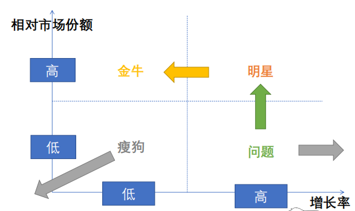
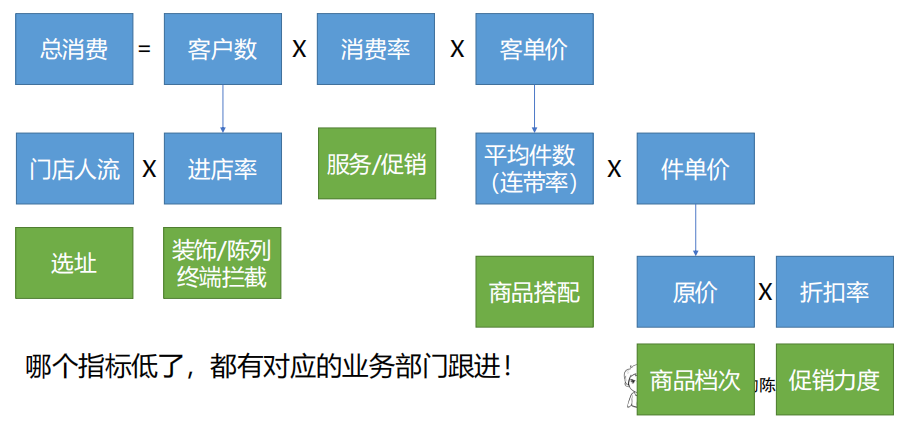
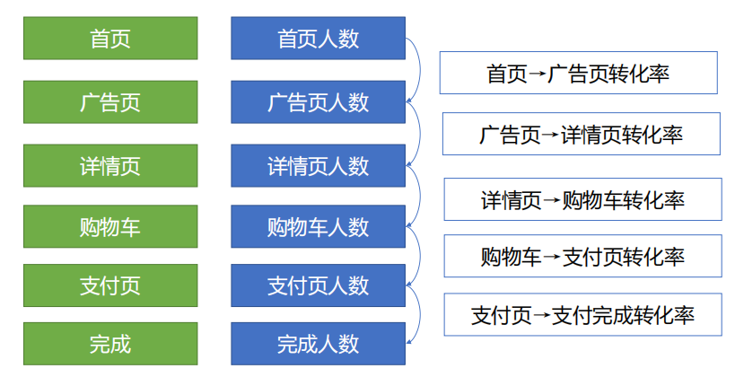

# 第3章 多指标分析方法

- 使用场景：不满足于只考察收入和成本，需要根据综合收入和成本两个指标评价业务，了解收入/成本是如何产生的，给出业务建议
- 策略：先做矩阵分析，综合评价好/坏，拆解过程，再看细节

# 4 矩阵分析法

- 定义：用两个**相关度较低**的指标描述一个事务，将两个指标进行**交叉分类**，区分事务类型，用**图形（散点图）**表示分类结果
- 制作矩阵的步骤：
    1. 明确对象+指标，准备数据
    2. 计算平均值进行分类
    3. 绘制散点图，观察数据形态
    4. 给每个分类命名，找出业务含义（利用矩阵提出建议）
- 应用场景：矩阵分析法自带标准，结论很清晰，业务指向明确，适合提建议
- 典型矩阵：波士顿矩阵

- 关键：
    - 清晰评估对象，选相关度低但重要的指标
    - 重点关注**左上**、**右下**的特殊区域，了解背后业务问题
    - 持续跟踪业务表现，发现产生了效果的业务动作，**监测变化**

- 不适合的场景：
    - 两个指标高度相关的时候（可用分层分析方法）
    - 个别样本太突出，剩下样本指标太过接近（可用分层分析方法）
    - 有可能投入产出不是在同一个时间发生，需要长时间观察走势（关注整体走势形态）

# 5 指标拆解法

- 指标拆解法和结构分析法的区别：指标拆解法产生了新的子指标，结构分析法没有产生子指标
- 定义：把一个大指标（通常是收入、成本这种关键指标）拆成若干个新的、有业务含义的子指标，通过解读子指标，来分析问题的方法
- 常见指标拆解：$\text{销售金额}=\text{注册用户数} \times \text{有消费比例} \times \text{客单价}$

- 关键：
    - 分解指标，不是盲目分解，而是分解成有业务含义，业务部门容易执行的指标
    - 最常见的分解，经常是一个数量指标\*一个质量指标
    - 好的分解方式，需要经过一段时间沉淀和积累

# 6 漏斗分析法

- 定义：即对整个流程中，每个环节参与人数，流失人数、上下环节之间转化人数进行计算，从而发现流程问题的方法
- 经典网上购物流程

- 影响漏斗转化的因素：
    - 局部变量（只会影响自身，在转化漏斗开头的位置）：广告投放渠道、广告文字/图片设计、操作流程是否长、操作指引是否清晰
    - 全局变量：品牌知名度、商品吸引力、促销吸引力、用户需求刚性
- 漏斗分析方法（完成了整个流程）：
    1. 哪里差了，补哪里（局部变量）
    2. 挑选更好的产品（有可能是颠覆式的整体改变）
    3. 观察改善效果（给每个转化流程圈定能力上下限，判断是否稳定）  
    4. 挑选更优质的渠道（结合矩阵分析）

- 关键：
    - 找到待分析的关键流程（要么是收入产生流程，要么是成本产生流程）
    - 梳理清楚，该流程上有哪些动作，确认每一步是否有数据产生
    - 计算每个流程的参与人数、完成人数，步骤之间转化率
    - 解读数据，发现关键问题，找到改进意见，观察改进效果